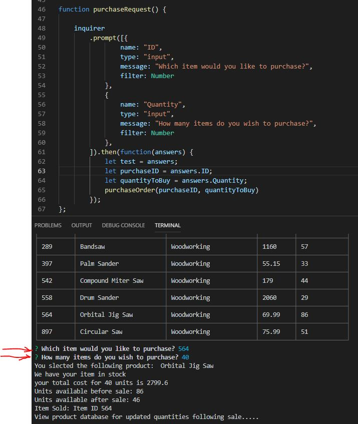
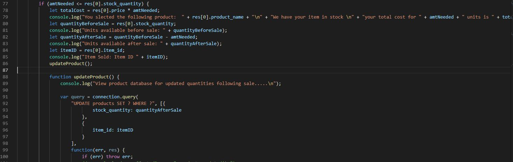
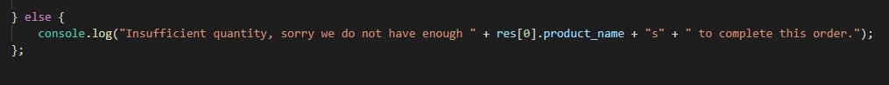
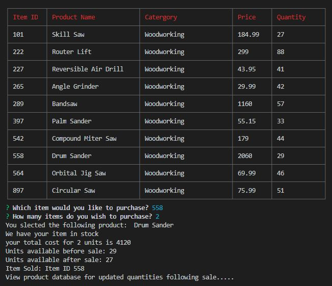
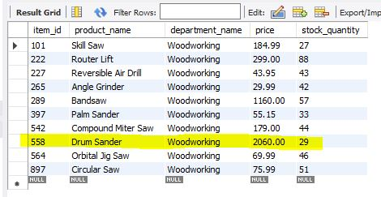
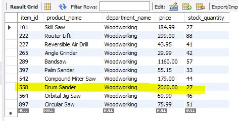
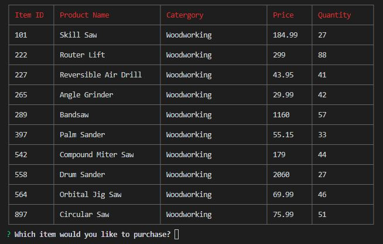
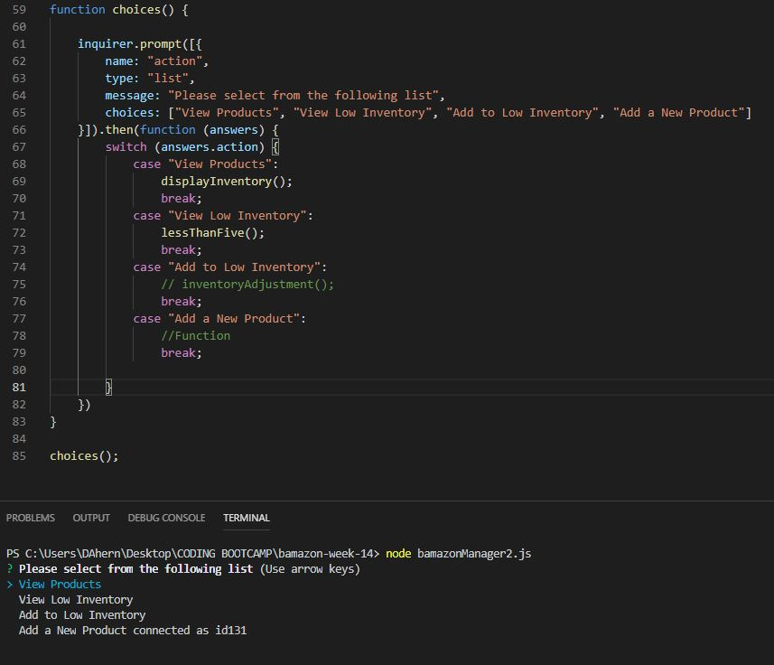
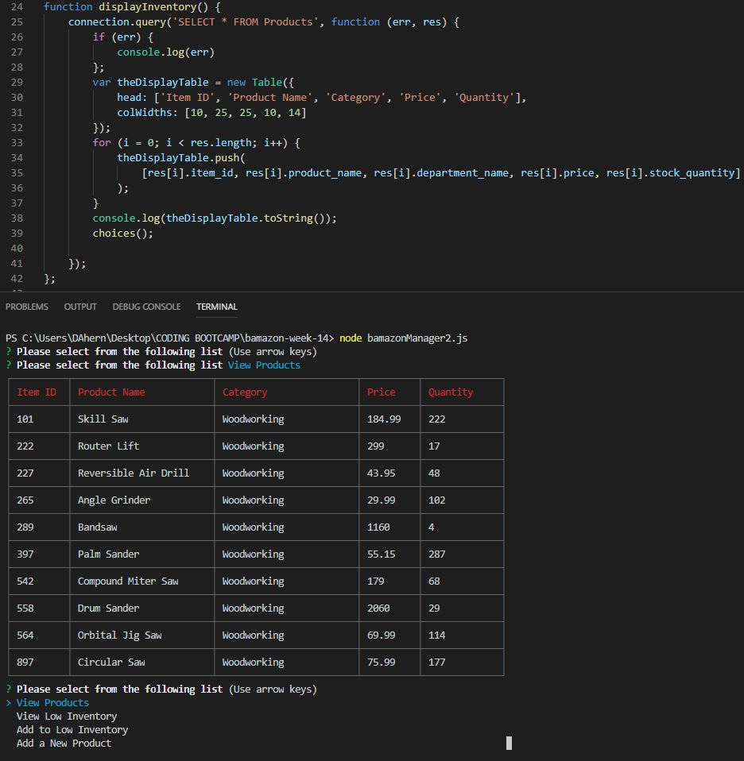
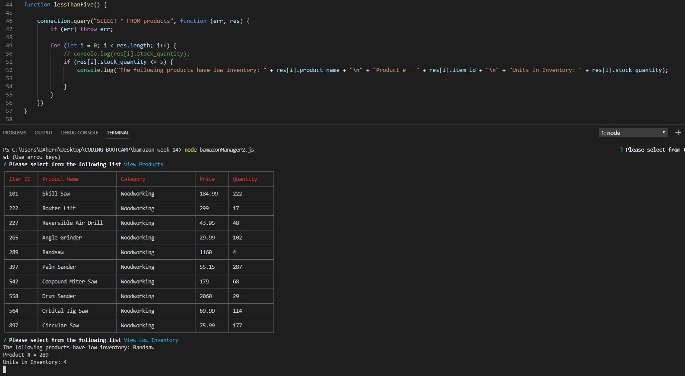

# bamazon-week-14

BAMAZON CUSTOMER VIEW:

Code to create table in MySQL Workbench

Running this application will first display all of the items available for sale. Used dependency "cli-table" to display data in table form in the CLI.

The first message asks for the ID of the product they would like to buy.
The second message asks how many units of the product they would like to buy.

If there is enough quantity on hand, a function is run to update the product quantity.

If there is insufficient quantity, then the following message is displayed.

When the customer purchases an item that is in stock, the following messages are displayed.  In this instance, the customer purchased 2 drum sanders @ $2,060.00 each for a total purchase price of $4,120.00.

Following the purchase, the quantity on hand is updated in both MySQL Workbench and in the CLI.

BEFORE:

AFTER:

You can also see the updated quantity here:

BAMAZON MANAGER VIEW:

Lists menu options:

View products for sale:

View low inventory items (less than 5 qty):

