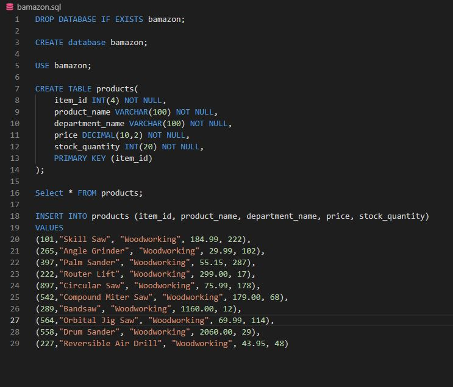
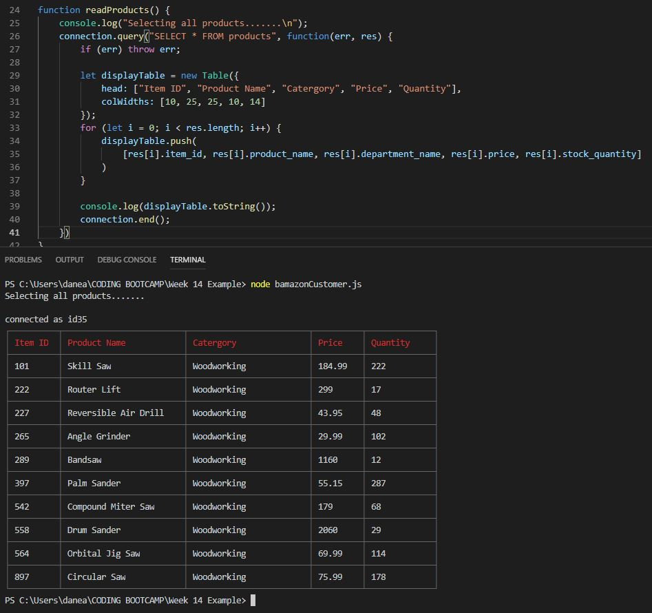

# bamazon-week-14

Code to create table in MySQL Workbench

Running this application will first display all of the items available for sale. Used dependency "cli-table" to display data in table form in the CLI.

